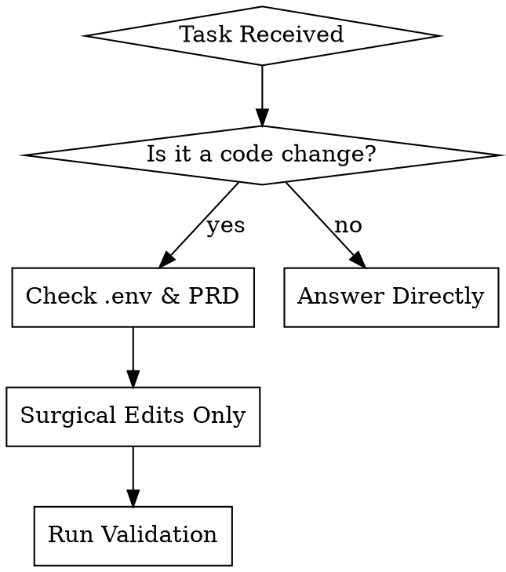

# 1000 JAY: Antigravity Agent Core Directives & Project Context

## Project Summary
A Python-based OCR utility that extracts text from schedule images using the OCR.space API and aggregates results into a CSV.

## Tech Stack
- **Language**: Python 3.12+
- **Libraries**: `requests` (for API calls), `csv`, `json`, `os`.
- **External Service**: OCR.space API.

## Critical Commands
- **Run Extraction**: `python main.py`
- **Install Dependencies**: `pip install requests`
- **Environment Setup**: Create a `.env` file with `OCR_API_KEY=your_key_here`.

## Project Structure
- `main.py`: Entry point, orchestrates file scanning and CSV writing.
- `helper.py`: Wrapper for OCR.space API calls.
- `schedule_images/`: Input directory for source images.
- `schedule_texts.csv`: Output file generated after a run.
- `docs/`: Technical documentation and API references.

## The Antigravity Flow

## Core Engineering Mandates (The Iron Law)

### 1. Surgical Edits & Context Efficiency
**Rule:** NEVER rewrite entire files for small logic changes. Use targeted `replace` operations. When investigating, read multiple files in parallel to save turns.
**Why:** Full rewrites break existing functionality, introduce unintended bugs, and waste context window tokens.

### 2. Absolute Security
**Rule:** NEVER hardcode API keys. Always use `os.environ.get("OCR_API_KEY")`. Do not commit `.env` files or any file containing credentials.
**Why:** Committing `.env` files or hardcoded keys compromises the system. Security is non-negotiable.

### 3. Bulletproof OCR Validation
**Rule:** Always verify the JSON response structure from OCR.space (specifically the nested `ParsedResults` array).
**Why:** The OCR.space API returns deeply nested JSON that can fail silently or return HTML error pages if rate limits are hit. Parse defensively.

### 4. Resilient Error Handling
**Rule:** Every API call (e.g., in `helper.py`) MUST handle `requests.exceptions.RequestException`.
**Why:** Network calls fail. Unhandled exceptions will crash the batch processor when handling multiple schedule images.

### 5. Strict Type Hinting
**Rule:** All new functions require comprehensive Python type hints.
**Why:** Enables static analysis, improves maintainability, and is crucial for the planned Phase 3 RAG integration with `google-genai`.

### 6. Evidence-Based Testing
**Rule:** Any change to text extraction logic MUST be verified with a mock JSON response or a sample image from the `schedule_images/` directory.
**Why:** Parsing changes cannot be validated by reading code alone. You must observe the output.

### 7. Coding Standards & Conventions
**Rule:** Use `snake_case` for all functions and variables. Keep `helper.py` purely functional (stateless). Ensure all file paths are handled using `os.path.join` for cross-platform compatibility.

## Quick Reference

| Action | Antigravity Requirement |
|--------|-------------------------|
| Adding a function | Must include type hints (`-> str`, `: int`) and docstrings. |
| Making an API call | Must wrap in `try...except requests.exceptions.RequestException`. |
| Updating an existing file | Must use targeted replacements, not full rewrites. |
| Handling credentials | Must use `os.environ.get()` or `.env` file reading. |
| File Paths | Must use `os.path.join()`. |

## Rationalization Table

Agents under pressure rationalize bad decisions. Do not fall for these.

| Excuse | Reality |
|--------|---------|
| "It's just a small script, I don't need type hints." | Phase 3 RAG integration requires strict schemas. Type hints are mandatory. |
| "The API key is only for testing, I'll hardcode it." | Hardcoded keys leak. Use `.env` or `os.environ`. |
| "I'll rewrite the file to make it cleaner." | Surgical edits only. Full rewrites violate context efficiency and risk regressions. |
| "The OCR JSON is standard, `json.loads` is enough." | OCR.space can return HTML error pages or nested error structures. Validate defensively. |
| "I'll test it later once the whole feature is built." | Evidence-based testing is required immediately for extraction logic. |

## Red Flags - STOP and Start Over

If you catch yourself doing any of the following, STOP immediately, delete your planned changes, and start over:
- You are about to write a full file replacement for a minor logic tweak.
- You are ignoring `requests.exceptions` during network operations.
- You are testing parsing logic without a mock JSON response or sample image.
- You are not checking alignment with the `PRD/Project Proposal (PRD).pdf` or `docs/api_schemas.md`.

**All of these mean: Delete the change. Start over with Antigravity precision.**
